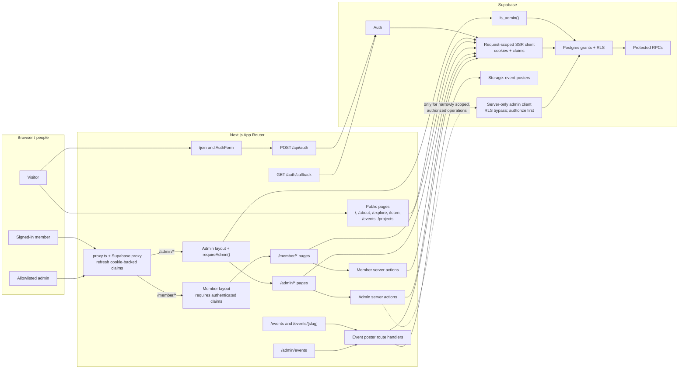
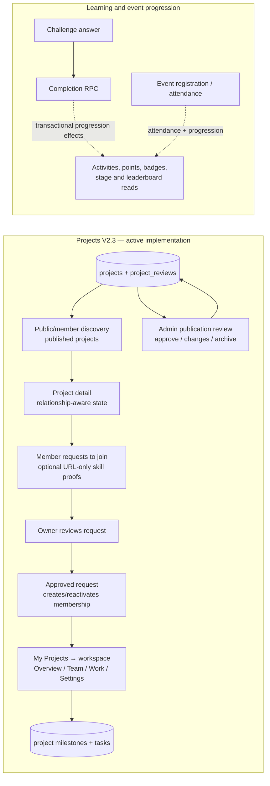
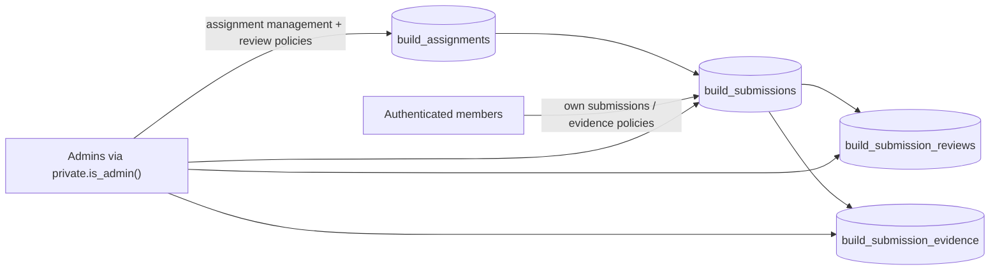

# Architecture

## Status

The architecture is **IMPLEMENTED in source**. Live deployment, schema parity, and authenticated runtime behavior are **NOT VERIFIED** in this documentation pass.

## Stack

- Next.js App Router, React, TypeScript, Tailwind/PostCSS, and `lucide-react`.
- Supabase Auth, Postgres, Row Level Security (RLS), Storage, and SQL RPCs.
- Server Components and route handlers for reads; server actions and service modules for mutations.
- Playwright for browser checks; ESLint and TypeScript for static checks.
- Vercel configuration exists in the workspace; deployment state is **NOT VERIFIED**.

## Request path

`Browser UI -> Next request/proxy -> Supabase SSR client -> Auth claims -> Postgres grants/RLS -> protected RPC or read -> service/UI`

`createAdminClient()` is a server-only, RLS-bypassing client for narrowly scoped operations after authorization. The browser receives only public Supabase configuration.

`proxy.ts` matches `/member/:path*` and `/admin/:path*` to refresh session cookies. The member layout redirects unauthenticated users to `/join`; the admin layout calls `requireAdmin()`, which checks `private.admin_users` through the `is_admin` RPC.

## Current-stage connectivity map

**Source snapshot:** 2026-10-02. This describes checked-in source wiring, not live deployment or runtime behavior. Solid arrows show connections visible in source; the existence of an edge does not prove deployed RLS, grants, RPC behavior, or database parity.

### Request and authorization boundaries

`proxy.ts` applies to `/member/:path*` and `/admin/:path*`; it refreshes session cookies rather than replacing database authorization. The member layout enforces sign-in. The admin layout uses `requireAdmin()` and `is_admin()` backed by the private admin allowlist. Grants, RLS, and RPC checks remain authoritative for data access and mutations. The service-role/admin client bypasses RLS and must only be used after explicit server-side authorization.

The public event-poster handler filters to published events and does not require a signed-in user; the admin poster handler checks admin claims before returning its poster. Both deliver objects from the `event-posters` bucket.

### Page, service, API, and data connections

Most reads are server-rendered through service/repository modules and the request-scoped Supabase client. Most mutations use server actions; the route handlers below are the explicit HTTP API surface identified in the current route inventory.

```mermaid
flowchart TB
  subgraph PublicPages["Public pages"]
    PublicHome["/, /about, /explore, /join snapshot"]
    PublicLearn["/learn"]
    PublicEvents["/events and /events/[slug]"]
    PublicProjects["/projects and /projects/[slug]"]
  end

  subgraph MemberPages["Authenticated member pages"]
    Dashboard["/member"]
    Learning["/member/profile, /journey, /learn"]
    Challenges["/member/challenges and /[slug]"]
    Events["/member/events and /[slug]"]
    Projects["/member/projects and /[id]"]
    Progress["/member/activities, /achievements, /leaderboard"]
  end

  subgraph AdminPages["Admin pages"]
    AdminOverview["/admin"]
    AdminContent["/admin/members, /learning, /challenges"]
    AdminEvents["/admin/events"]
    AdminProjects["/admin/projects"]
    AdminInsights["/admin/explore, /analytics, /activities,<br/>/leaderboard, /achievements, /settings"]
  end

  subgraph Server["Server-side services and actions"]
    Snapshot["getPublicCommunitySnapshot()<br/>lib/services/community.ts"]
    LearningService["Learning repository<br/>lib/services.ts"]
    EventService["Event services<br/>lib/services/events.ts"]
    ProjectService["Project services<br/>lib/services/projects.ts"]
    AdminRead["Admin service modules<br/>community + admin-*"]
    ChallengeAction["Challenge answer action"]
    EventAction["Event registration/cancellation actions"]
    ProjectAction["Project + workspace actions"]
    AdminAction["Admin content/event/project actions"]
    AuthRoute["POST /api/auth<br/>password sign-in + destination"]
    AuthCallback["GET /auth/callback<br/>code exchange + redirect"]
    EventPoster["GET /api/events/[slug]/poster"]
    AdminPoster["GET /api/admin/events/[id]/poster"]
  end

  subgraph Data["Supabase data and operations"]
    Catalog[("learning_paths, challenges,<br/>challenge_contents")]
    MemberData[("profiles, user_challenge_progress,<br/>activities, user_badges")]
    EventData[("events, event_attendees")]
    ProjectData[("projects, project_members,<br/>project_join_requests,<br/>project_join_request_proofs,<br/>project_reviews, project_milestones,<br/>project_tasks")]
    AdminData[("Admin read projections<br/>and managed content")]
    LearnRPC["submit_challenge_answer"]
    EventRPC["get_event_availability(ies)<br/>register_for_event<br/>cancel_event_registration<br/>record_event_attendance"]
    ProjectRPC["create_project_v1<br/>submit_project_for_review<br/>request_project_join<br/>submit_project_work<br/>plus join-review/workspace RPCs"]
    AdminProjectRPC["admin_update_project_v1<br/>review_project_member<br/>review_project_publication<br/>recover_project_ownership"]
    PosterStorage[("event-posters bucket")]
    Auth["Supabase Auth"]
  end

  PublicHome --> Snapshot
  PublicLearn --> LearningService
  PublicLearn --> ProjectService
  PublicEvents --> EventService
  PublicProjects --> ProjectService
  Dashboard --> MemberData
  Learning --> LearningService
  Challenges --> LearningService
  Events --> EventService
  Projects --> ProjectService
  Progress --> MemberData
  AdminOverview --> AdminRead
  AdminContent --> AdminRead
  AdminEvents --> AdminRead
  AdminProjects --> AdminRead
  AdminInsights --> AdminRead

  Snapshot --> LearningService
  Snapshot --> EventService
  Snapshot --> ProjectService
  LearningService --> Catalog
  LearningService --> MemberData
  EventService --> EventData
  EventService --> EventRPC
  ProjectService --> ProjectData
  AdminRead --> AdminData
  AdminRead --> EventData
  AdminRead --> ProjectData

  Challenges --> ChallengeAction
  ChallengeAction --> LearnRPC
  LearnRPC --> MemberData
  Events --> EventAction
  EventAction --> EventRPC
  EventRPC --> EventData
  Projects --> ProjectAction
  ProjectAction --> ProjectRPC
  ProjectRPC --> ProjectData
  AdminContent --> AdminAction
  AdminEvents --> AdminAction
  AdminProjects --> AdminAction
  AdminAction --> AdminData
  AdminAction --> EventRPC
  AdminAction --> AdminProjectRPC

  AuthRoute --> Auth
  AuthCallback --> Auth
  PublicEvents --> EventPoster
  EventPoster --> PosterStorage
  AdminEvents --> AdminPoster
  AdminPoster --> PosterStorage
```

The diagram groups some closely related pages where they share a service family; it does not imply that every page reads every table listed for that family. The route inventory is in [ROUTES.md](./ROUTES.md). Exact source entry points include [lib/services/community.ts](../lib/services/community.ts), [lib/services/events.ts](../lib/services/events.ts), [lib/services/projects.ts](../lib/services/projects.ts), [app/member/challenges/actions.ts](../app/member/challenges/actions.ts), [app/member/events/actions.ts](../app/member/events/actions.ts), and [app/member/projects/actions.ts](../app/member/projects/actions.ts).

### Key workflows at the current stage

Project publication/lifecycle, join review, and workspace operations are server-action/RPC-mediated in source; workspace access and writable states are separate from historical participation evidence. Challenge completion is delegated to `submit_challenge_answer`; event registration/cancellation and attendance use their named RPCs. The progression side effects are shown as database-owned effects, not as a direct page-to-page API call.

### Attached Build & Prove migration: database-only foundation

The attached [20260919160000_build_prove_phase_1.sql](../supabase/migrations/20260919160000_build_prove_phase_1.sql) creates a **separate additive domain**:

This migration adds lifecycle synchronization triggers, RLS, grants, policies, and indexes for assignments, submissions, reviews, and evidence. In the current traced route/service inventory, **no page, API handler, or service/action is connected to these `build_*` tables**. Treat this as schema groundwork rather than an implemented user journey. Do not infer live policy execution or deployed database parity from the migration file alone.

### Verification status and limits

- **Implemented in source:** Next.js page/service/action structure, auth gates, project discovery and workspace source, event poster handlers, and the `build_*` migration objects.
- **Not verified here:** live migration parity, actual deployed RLS/grants/RPC behavior, storage policy enforcement, authenticated member/admin browser flows, and production deployment.
- **Not traced as active route wiring:** separate modules under `data/` and backup files. Their presence is not evidence that app routes call them.

## Design direction

The UI is a bright, spacious AWS-inspired learning and builder workspace: navy navigation/sidebar surfaces, card-based content, semantic status colors, responsive layouts, and a stronger visual hierarchy for podium/leaderboard recognition. Recent visual work intentionally changed presentation only; backend and data behavior remain unchanged.
